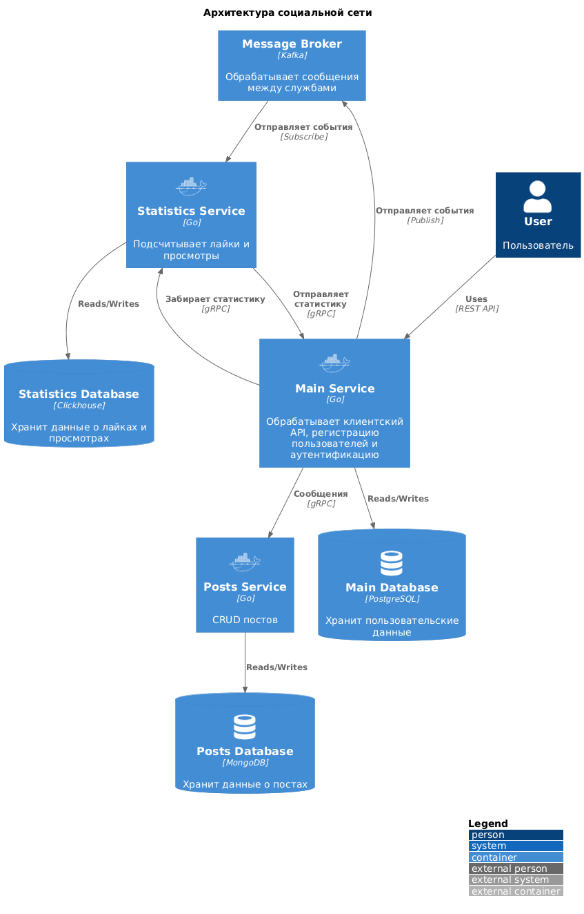

# Social Network

Учебный проект "Социальная сеть" с микросервисами. Три Go‑сервиса взаимодействуют по gRPC и Kafka, хранение данных в Postgres, MongoDB и ClickHouse.

## Архитектура сервисов


## Быстрый старт
```bash
docker compose up --build
# main-service: http://localhost:8080
# posts-service gRPC: localhost:50051
# stats-service: http://localhost:8081
```
Остановить и очистить данные: `docker compose down -v`.

## API
- **main-service** — REST спецификация `main-service/openapi.yaml`.
- **posts-service** — gRPC контракт `posts-service/proto/posts.proto` и OpenAPI‑описание HTTP-прокси `posts-service/openapi.yml`.
- **stats-service** — gRPC контракт `stats-service/proto/stats.proto` и OpenAPI для HTTP‑эндпоинтов `stats-service/openapi.yaml`.

## Примеры использования
```bash
# Регистрация пользователя
curl -X POST http://localhost:8080/auth/register \
  -H "Content-Type: application/json" \
  -d '{"login":"demo","password":"DemoPass123"}'

# Авторизация и получение JWT
TOKEN=$(curl -s -X POST http://localhost:8080/auth/login \
  -H "Content-Type: application/json" \
  -d '{"login":"demo","password":"DemoPass123"}' | jq -r .token)

# Создание поста (нужен токен)
curl -X POST http://localhost:8080/posts \
  -H "Authorization: Bearer $TOKEN" \
  -H "Content-Type: application/json" \
  -d '{"title":"Привет","content":"Первый пост"}'

# Список постов с пагинацией
curl "http://localhost:8080/posts?page=1&page_size=5"

# Изменение поста
curl -X PUT http://localhost:8080/posts/<post-id> \
  -H "Authorization: Bearer $TOKEN" \
  -H "Content-Type: application/json" \
  -d '{"title":"Новый заголовок","content":"Обновлённый текст"}'

# Удаление поста
curl -X DELETE http://localhost:8080/posts/<post-id> \
  -H "Authorization: Bearer $TOKEN"

# Поставить просмотр и лайк посту
curl -X POST http://localhost:8080/posts/<post-id>/view
curl -X POST http://localhost:8080/posts/<post-id>/like

# Статистика по посту
curl "http://localhost:8080/stats/post?id=<post-id>"

# Профиль текущего пользователя
curl -H "Authorization: Bearer $TOKEN" http://localhost:8080/users/me

# Обновление профиля
curl -X PUT http://localhost:8080/users/me/update \
  -H "Authorization: Bearer $TOKEN" \
  -H "Content-Type: application/json" \
  -d '{"first_name":"Alex","email":"alex@example.com"}'

# Топ постов по лайкам
curl "http://localhost:8080/stats/top-posts?metric=likes"

# Топ авторов по лайкам
curl http://localhost:8080/stats/top-users
```

## Тесты
```bash
# из каталога конкретного сервиса
cd main-service && go test ./...
cd ../posts-service && go test ./...
cd ../stats-service && go test ./...
```
